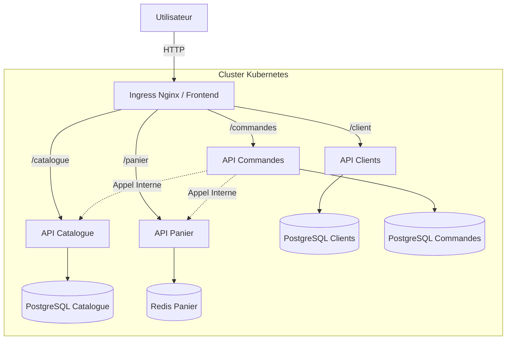

# Plateforme E-Commerce Microservices

Bienvenue dans la documentation complète du projet SAE DevCloud. Ce document détaille l'architecture, l'infrastructure, et le fonctionnement de chaque composant du système.

---

## Table des Matières

1. [Vue d'ensemble](#vue-densemble)
2. [Architecture Globale](#architecture-globale)
3. [Infrastructure & Déploiement](#infrastructure--déploiement)
4. [Détail des Microservices (APIs)](#détail-des-microservices-apis)
   - [API Catalogue](#api-catalogue)
   - [API Clients (Auth)](#api-clients-auth)
   - [API Panier](#api-panier)
   - [API Commandes](#api-commandes)
5. [Frontend & Interface](#frontend--interface)
6. [Scénarios de Flux de Données](#scénarios-de-flux-de-données)
7. [Guide de Démarrage](#guide-de-démarrage)

---

## Vue d'ensemble

Ce projet est une application e-commerce complète conçue pour démontrer une architecture **Microservices** distribuée. Contrairement à une application monolithique classique, chaque fonctionnalité métier est isolée dans son propre service, avec sa propre base de données.

**Objectifs techniques :**
- **Scalabilité** : Chaque service peut être redimensionné indépendamment.
- **Résilience** : La panne d'un service (ex: Panier) n'empêche pas forcément les autres de fonctionner (ex: Catalogue).
- **Isolation** : Les données sont cloisonnées (Pattern *Database-per-Service*).

---

## Architecture Globale

Le système repose sur un cluster **Kubernetes** composé de 3 nœuds (1 Master, 2 Workers).



---

## Infrastructure & Déploiement

L'infrastructure est entièrement définie en code (**IaC** - Infrastructure as Code).

### 1. Virtualisation (Vagrant)
Nous utilisons **Vagrant** pour créer 3 machines virtuelles Debian 12 sur votre machine hôte.
- **Master** (`192.168.56.10`) : Pilote le cluster Kubernetes.
- **Worker 1 & 2** (`.11`, `.12`) : Exécutent les applications.

### 2. Configuration (Ansible)
**Ansible** automatise l'installation des logiciels sur ces VMs :
- Installation de Docker, Kubeadm, Kubelet.
- Initialisation du cluster Kubernetes.
- Jonction des workers au cluster.
- Build des images Docker des APIs.
- Déploiement des fichiers YAML Kubernetes.

### 3. Orchestration (Kubernetes)
Kubernetes gère le cycle de vie des applications :
- **Deployments** : Assurent que les pods (conteneurs) tournent toujours.
- **Services** : Exposent les pods sur le réseau interne ou externe.
- **ConfigMaps/Secrets** : Gèrent la configuration (URLs, mots de passe) sans rebuilder les images.

[Voir le Guide Infrastructure détaillé](infrastructure/README.md)

---

## Détail des Microservices (APIs)

Chaque API est développée en **Python (FastAPI)** et tourne dans son propre conteneur Docker.

### API Catalogue
Gère l'inventaire des produits.
- **Rôle** : Lister les produits, afficher les détails, gérer les stocks.
- **Base de données** : PostgreSQL dédié (`catalogue-db`).
- **Particularité** : C'est la source de vérité pour les prix et les stocks.
- [Documentation Technique Catalogue](api/catalogue-api/README.md)

### API Clients (Auth)
Gère les utilisateurs et la sécurité.
- **Rôle** : Inscription, Connexion, Profil.
- **Sécurité** : Utilise des **JWT (JSON Web Tokens)**. Quand un utilisateur se connecte, il reçoit un token qu'il doit envoyer aux autres APIs pour prouver son identité.
- **Base de données** : PostgreSQL dédié (`client-db`).
- [Documentation Technique Clients](api/client-api/README.md)

### API Panier
Gère les paniers temporaires des utilisateurs.
- **Rôle** : Ajouter/Retirer des articles, Vider le panier.
- **Base de données** : **Redis** (NoSQL).
- **Pourquoi Redis ?** : Le panier est une donnée volatile et très souvent accédée. Redis (en mémoire) est beaucoup plus rapide qu'une base SQL classique pour ce cas d'usage. Les paniers ont une durée de vie limitée (TTL).
- [Documentation Technique Panier](api/panier-api/README.md)

### API Commandes
Gère le processus d'achat.
- **Rôle** : Valider une commande, créer la facture, archiver l'historique.
- **Orchestration** : C'est le service le plus complexe. Lors d'une commande :
  1. Il vérifie le stock via l'**API Catalogue**.
  2. Il récupère le contenu du panier via l'**API Panier**.
  3. Il enregistre la commande dans sa base **PostgreSQL**.
  4. Il demande à l'API Panier de se vider.
- [Documentation Technique Commandes](api/commandes-api/README.md)

---

## Frontend & Interface

L'interface utilisateur est une application **React** moderne (Vite + TypeScript).
- Elle ne stocke aucune donnée elle-même.
- Elle interroge les APIs via le navigateur de l'utilisateur.
- **Nginx** sert les fichiers du frontend ET agit comme **Reverse Proxy** :
  - `http://192.168.56.10:30080/` -> Frontend React
  - `http://192.168.56.10:30080/catalogue/*` -> API Catalogue
  - `http://192.168.56.10:30080/client/*` -> API Clients
  - etc.

---

## Scénarios de Flux de Données

### Exemple : "Je passe une commande"

1. **Frontend** : L'utilisateur clique sur "Payer".
2. **Frontend** -> **API Commandes** : Envoie une requête `POST /orders` avec le Token JWT.
3. **API Commandes** :
   - Vérifie le Token (est-ce bien un client connecté ?).
   - Appelle **API Panier** (interne) : "Donne-moi les articles de ce client".
   - Pour chaque article, appelle **API Catalogue** (interne) : "Vérifie le stock et le prix actuel".
   - Si tout est OK : Crée la commande en BDD.
   - Appelle **API Panier** : "Vide le panier".
   - Retourne "Succès" au Frontend.
4. **Frontend** : Affiche "Commande validée !".

---

## Guide de Démarrage

Pour lancer tout le projet depuis zéro :

1. **Prérequis** : Avoir VirtualBox et Vagrant installés.
2. **Lancer le script de déploiement** :
   ```bash
   ./deploy.sh
   ```
   *(Ce script lance `vagrant up` qui déclenche Ansible)*.

3. **Accéder à l'application** :
   - Ouvrez votre navigateur sur : **http://192.168.56.10:30080**

4. **Comptes de test** :
   - Admin : `admin` / `admin`
   - Client : Vous pouvez en créer un via le formulaire d'inscription.

---


